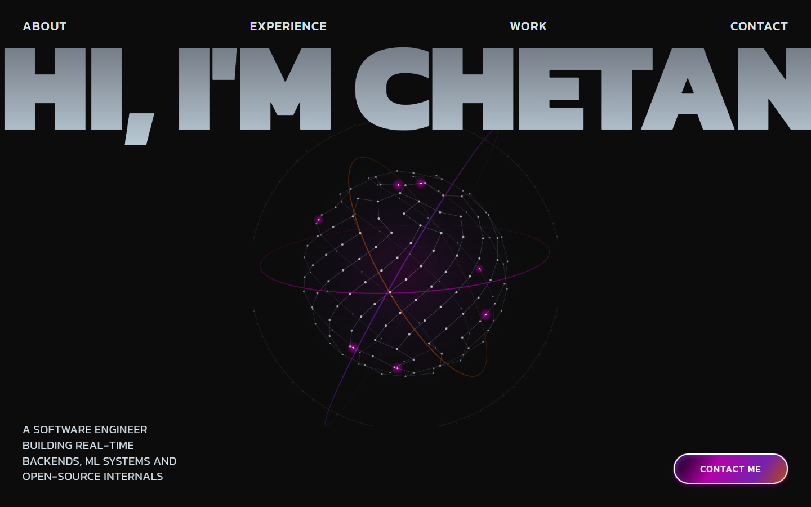
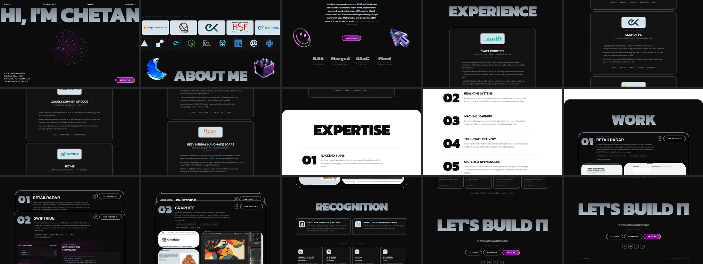

# Chetan Sahney — Portfolio

A single-page portfolio built on the 3D-creator landing-page spec (dark `#0C0C0C`,
Kanit 300–900, gradient display type, scroll-driven motion), filled with real
content from the resume, [GitHub](https://github.com/Chetansahney) and LinkedIn.

React 18 · TypeScript · Vite · Tailwind CSS 3 · Framer Motion 12 · Lucide React

```bash
npm install
npm run dev      # http://localhost:5173
npm run build    # -> dist/
npm run preview
```






## Sections

| # | Section | Notes |
|---|---------|-------|
| 1 | `HeroSection` | `hi, i'm chetan` gradient display type, the `HeroVisual` node field, staggered fade-ins |
| 2 | `MarqueeSection` | Two scroll-driven rows: companies/orgs on light plates, stack icons on dark tiles. Set width is measured from the DOM, so each row travels 1.45 sets over the section's visible life — every one of the 9 orgs and 25 tools passes the viewport |
| 3 | `AboutSection` | Character-by-character scroll reveal, four 3D corner objects, four headline stats |
| 3b | `StatsSection` | The four headline numbers, in their own strip — inside About the wide row ran through the corner 3D decor |
| 4 | `ExperienceSection` | Five roles, each centred under its company logo, with metric bullets and stack chips |
| 4b | `SkillsSection` | Languages, frameworks, data/analytics and CS concepts, taken from the resume |
| 5 | `ExpertiseSection` | White rounded-top panel, five numbered capabilities |
| 6 | `ProjectsSection` | Three sticky cards that scale-stack on scroll |
| 7 | `AchievementsSection` | Amazon ML Summer School and open-source PRs, then a card per competitive-programming platform (Codeforces Specialist, 3-star CodeChef, 400+ LeetCode, Kaggle Silver) linking to each profile |
| 8 | `ContactSection` | Email, GitHub, LinkedIn, competitive-programming profiles |

## Content

All copy, links and metrics live in one file: [`src/lib/data.ts`](src/lib/data.ts).
Edit there rather than in components.

## Assets

Everything is local under `public/` — no hotlinking, so nothing breaks if a
third-party host changes.

- `public/logos/` — company and org marks: Swift Robotics (their wordmark),
  Google Summer of Code, Graphite (their transparent SVG), Ekam Apps, CERN HSF,
  the sktime wordmark, Amazon, Neev, BIT Mesra, plus LeetCode / Codeforces /
  CodeChef / Kaggle / GitHub icons.
  All trimmed of surrounding whitespace so they sit at a consistent optical size
  inside the `.logo-plate` tiles.
- `public/tech/` — 29 stack icons (Simple Icons; brand colours, with the
  black-on-black ones recoloured to `#D7E2EA`).
- `public/decor/` — the 3D avatar and four decorative objects.
- `public/projects/` — project card imagery:
  - `rr-*.jpg` — real screenshots of the live RetailRadar app
  - `gr-*.jpg` — real screenshots of graphite.rs, including the editor
  - `sw-*.png` — custom panels rendered in this site's own visual language
    (event pipeline, production metrics, socket handler). SwiftRide's deployed
    landing page renders third-party artwork, so it isn't used as card imagery.

Project card images are cut to the exact aspect ratios of their slots
(2.51 / 1.89 / 1.58 at desktop) so `object-cover` does not crop labels.

## Notes

- Company logos are the property of their respective owners and are used here to
  identify past employers and collaborations.
- `AnimatedText` wraps each word in its own inline-block so the per-character
  animation cannot break a word mid-way; the spaces between words stay as real
  text nodes, which are the only soft wrap opportunities. Each character is a
  single span rather than the invisible-placeholder-plus-overlay pattern: that
  put every character in the DOM twice, so copying the paragraph produced
  "II bbuuiilldd" and screen readers announced each letter twice.
- `vite.config.ts` sets `resolve.preserveSymlinks` and `server.fs.strict: false`
  so the dev server works when the project sits behind a Windows junction.
- Swap `public/decor/portrait.webp` for a real photo or 3D avatar to make the hero
  personal; nothing else needs to change.

## Hero centrepiece

`src/components/HeroVisual.tsx` draws the rotating node field on a canvas: 150
points spread over a sphere by the golden-angle spiral, wired to their two
nearest neighbours (computed once, so the mesh stays stable as it turns), three
inclined orbital rings and packets running the links. Depth comes from a real
perspective projection — size, line weight and alpha all key off z.

- Leans toward the cursor, on top of the `Magnet` wrapper the rest of the page uses.
- `prefers-reduced-motion: reduce` renders a single static frame and starts no loop.
- An `IntersectionObserver` cancels the frame loop once the hero scrolls away
  (verified: zero draws while off-screen).
- Assigning `canvas.width` clears the bitmap, so `resize()` repaints immediately
  — otherwise `ResizeObserver`'s initial call leaves the canvas blank, permanently
  so under reduced motion.

To use a photo instead, set `heroPortrait` in `src/lib/data.ts` to its path in
`public/` — the hero swaps to an `` and skips the canvas entirely.
